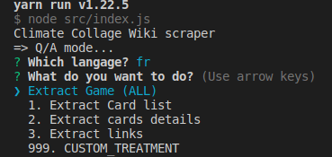
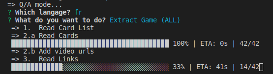

[](https://github.com/JulienRobberechts/climate-collage-wiki-scraping/actions/workflows/test.yml) but the tests are pretty unstable because they fetch the wiki API so it's better to check on your local machine !

# Climate Collage Wiki Scraping

This project extract some data from the ["Fresque du Climat" wiki ](https://fresqueduclimat.org/wiki/index.php?title=Jeu_adulte) (french version) to put them into a usable JSON format for the Climat Collage Memo in French.

The french version is in work in progress. The goal is to have a one click import in French and English.

## Launch the program

#### 1. Run the start command

It's supposed to run on your local machine with an internet access.

#### 1.A With Prompt
```cmd
yarn start
```

You should be able to select your action in a menu:



#### 1.B With on of the direct command

```cmd
yarn start import --lang fr
yarn start import -l fr
yarn start import -l en
```
#### 2. Then to see the execution progress



#### 3. Then the result of the extraction should be updated in the data/results folder of the project:


## Tests

There are two types of tests:

- Some tests are done to check the generic behavior of the program.
- Some are to check that the data fetched from the wiki are what we expect. The targets used for that are files in the /data/latest-target directory. Those latest-target files are temporary and modified when the automatic result is better than the expected result. Those latest-target files will probably be removed when the scrapper could be trusted enough.

### run tests locally

```cmd
yarn test
```

### run tests on github

Tests are played on github (tab Actions)
- after each code change
- every day at 1pm automatically to check everything is still ok.
- manually on demand if you click on this green button "run workflow":
  

but the tests are pretty unstable because they fetch the wiki api so it's better to check on your local machine !

## links

- [Climate Collage Memo project on GitHub](https://github.com/JulienRobberechts/memo-fresque-du-climat)
- [Climate Collage Memo live in French](https://memo-fresque-du-climat.onrender.com)
- [Climate Collage French official page](https://fresqueduclimat.org/)
- [Climate Collage English official page](https://climatecollage.org/)
- [Climate Collage Wiki in French](https://fresqueduclimat.org/wiki)
- [Climate Collage Wiki in English](https://fresqueduclimat.org/wiki/en) (beta)

## Roadmap

1. First manual import in French. DONE
2. automate the export to the memo (not so important because it could be done every month manually by a copy-paste)
3. replicate the same in English (WE NEED YOU!)

## Other project ideas

If you are developer and want to help, you can find here some ideas for project around the Climate Collage:

### Wiki generator

There are today 2 wikis in French and English but we probably need a wiki in all languages (more than 40 nowadays).
Create a new wiki from scratch is tedious, we need to find a way to generate this work, at least 80% of it.
